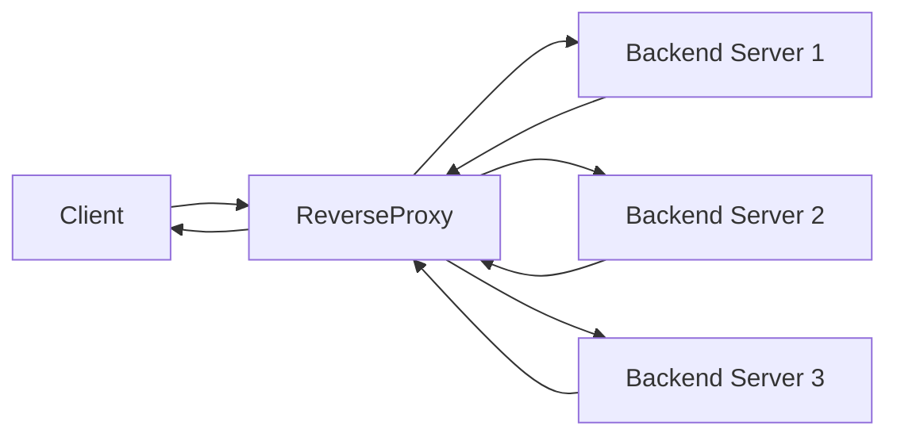

# Reverse Proxy – UI/UX Design

A clean **UI/UX desktop web design** that explains how a **Reverse Proxy** works in a simple and visual way.

---

## What is a Reverse Proxy?
A reverse proxy sits between clients and backend servers.  
It receives client requests, then forwards them to the appropriate backend server.

---

## How It Works
- Client sends a request
- Reverse Proxy receives and processes it
- Request is forwarded to one of the backend servers
- Response goes back through the proxy to the client

---

## Reverse Proxy Flow Diagram

---

## Pages
- Home Page (concept, flow, key features)
- Sign In / Sign Up
- Dashboard (work in progress)

---

## Design
- Desktop Web
- Clean & minimal
- clean animations
- Focus on clarity

---

## Tools
- Figma
https://www.figma.com/design/IaWUoMddGjcu6IjJUCR9sx/git_ingore?node-id=15-51&t=t0TO002QfHfWFBEb-1
